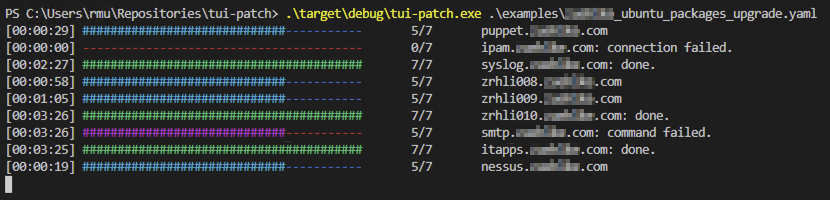

# tui-patch
Execute commands over SSH on multiple hosts

## Installation of Rust
Go to https://rustup.rs/ follow the instructions to install the rust compiler.
Clone this repository and run following command inside the repository to compile:
```sh
cargo build 
```

## Usage example
Make sure your SSH keys are loaded with a SSH agent.
All Hosts in a file will run simultaniously. It will create a folder in current directory ./log/ with log files from the SSH output for each host.
The log files will be written when each command terminates.

```sh
./target/debug/tui-patch ./examples/ubuntu_packages_upgrade.yaml
```



## Configuration example
Each config file must exist of a tasks and targets section. See for more details in examples folder.
```yaml
# tasks is a list with all commands which should be executed in one ssh session
tasks: &tasks
  # command (eg. hostnamectl status) which should be executed on the target host
  - command: 'hostnamectl status'
    # expected return value of the exectued command
    expected_result: 0
    # dependend on the match of the value if following commands should be executed as well or not
    stop_on_error: false
  # second command
  - command: 'service --status-all'
    expected_result: 0
    stop_on_error: false

# targets are a list of remote hosts
targets:
    # hostname used
  - host: 'server1.domain.com'
    user: 'user'
    # if password login is used specify password
    password: 'password'
    # optional port (default 22 if not specified)
    port: 22
    # referes to tasks list (it must be called tasks)
    tasks: *tasks

  - host: 'server2'
    # if only username is specified ssh agent is used with key login
    user: 'admin'
    tasks: *tasks

  - host: 'server3'
    # specify remote login username/search name for username in bitwarden
    user: 'admin'
    # use the bitwarden stored password (password can never be "bitwarden")
    password: 'bitwarden'
    tasks: *tasks
```